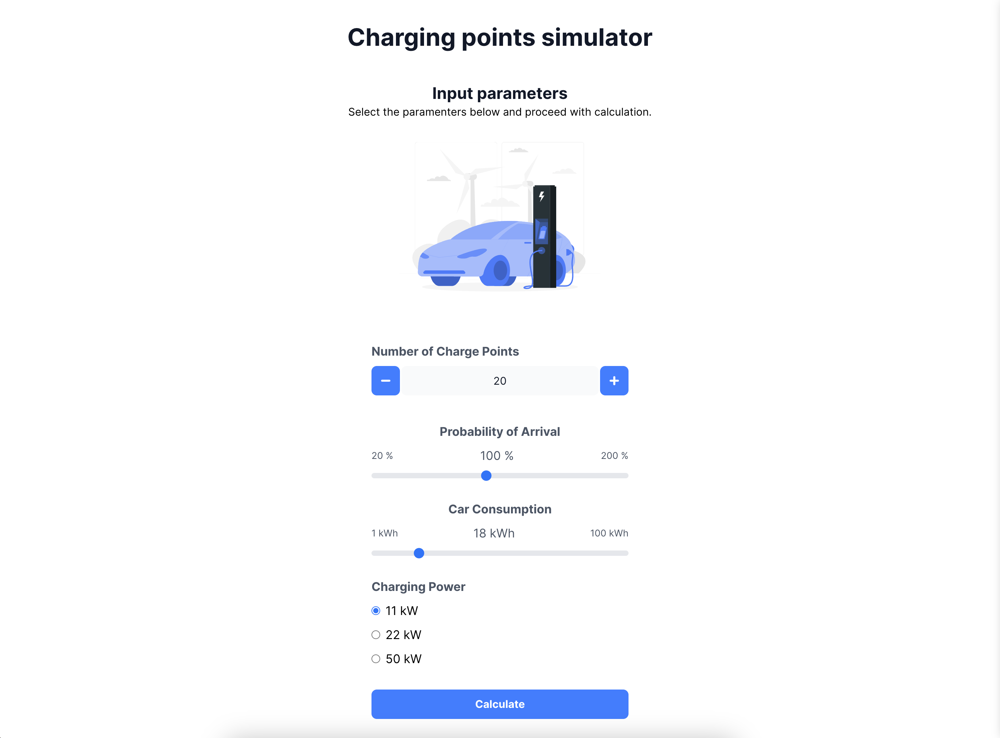

# Chargepoints Challenge

This project is a solution to the Chargepoints Challenge. It provides an input form and a couple of visualized output data.

Published at: [http://chargepoints-challenge.netlify.app](http://chargepoints-challenge.netlify.app)



## Installation

1. Install the dependencies:

```sh
npm install
```

2. Start the project locally:

```sh
npm run dev
```

3. Build the project:

```sh
npm run build
```

4. Run the tests:

```sh
npm run test
```

## Technologies

The application is build using React and TypeScript. It uses the following libraries:

- [React](https://reactjs.org/)
- [TypeScript](https://www.typescriptlang.org/)
- [Jest](https://jestjs.io/) for some basic unit tests.
- [Tailwind CSS](https://tailwindcss.com/) for styling.
- [Recharts](https://www.recharts.org/) for the charts.
